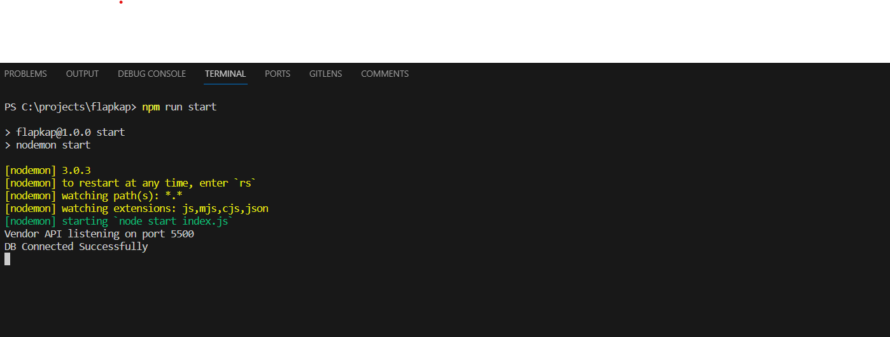

Welcome to Vendor Api task

Used Framework: nodejs
prerequisites: nodejs, rest vscode extension

How to run it:
1- After cloning run npm install to install the required packages
2- install rest vscode extension
3- execute 'npm run start' in terminal to run the server

4- there is two .rest files, request.rest this is the valid api calls to test the API,
InvalidTests.rest is a file that contains an invalid tests to test the error messages and status codes.
Simply open the file and click on 'Send request' it going to send request to the server and display the response

